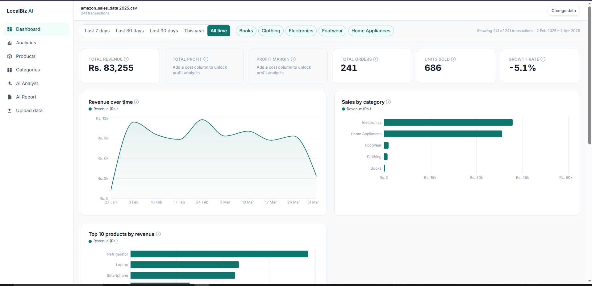
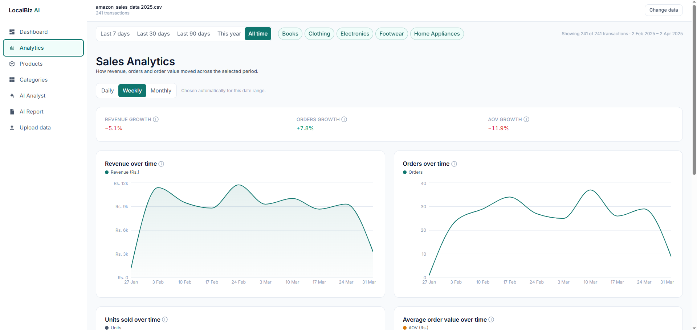
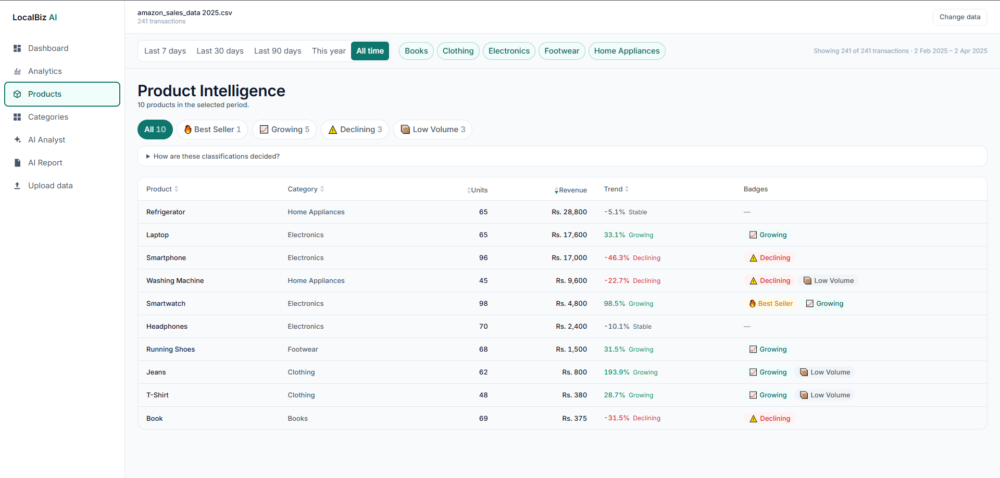
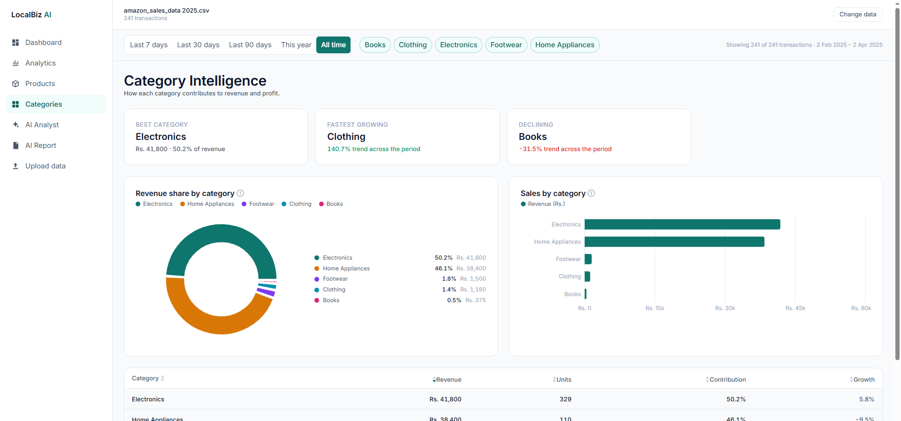
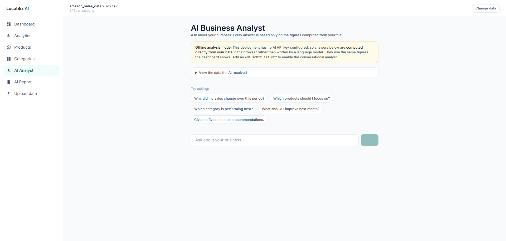
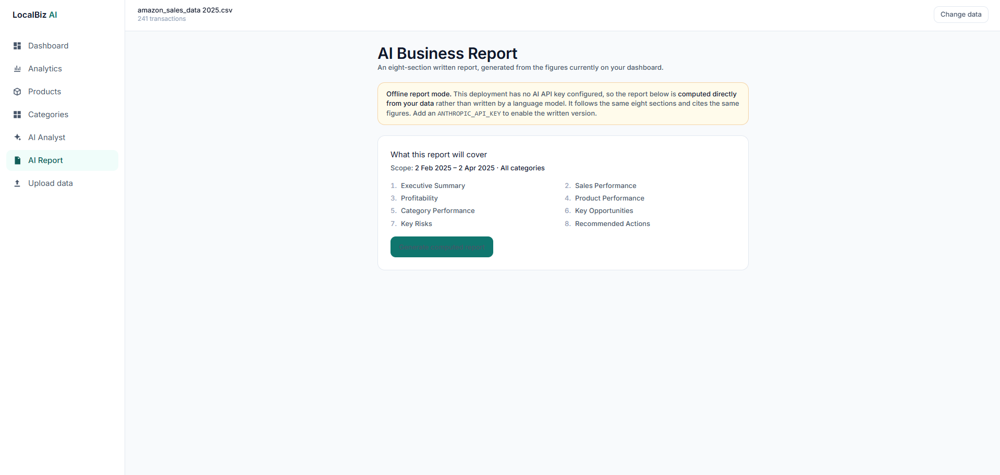

# LocalBiz AI

> **Turn your business data into better decisions.**

A browser-based business intelligence tool for small Pakistani businesses. Upload the sales file you
already keep — a CSV export or an Excel sheet — and get a working dashboard, product-level
intelligence, and an AI analyst that answers questions in plain language using only your real numbers.

[](https://localbiz-ai-alpha.vercel.app/)
[](LICENSE)
[](#testing)

## 🔗 Live Demo

### **→ [https://localbiz-ai-alpha.vercel.app/](https://localbiz-ai-alpha.vercel.app/)**

Click **"Try the demo"** on the dashboard for a fully populated instance — 520 transactions of
sample data, loaded instantly. **No signup, no upload, no email gate.**

---

## 📑 Table of Contents

- [The Problem](#-the-problem)
- [What It Does](#-what-it-does)
- [Screenshots](#-screenshots)
- [Features](#-features)
- [The AI Feature](#-the-ai-feature)
- [System Prompt](#system-prompt)
- [Tools, Services & Models](#-tools-services--models)
- [How It Works](#-how-it-works)
- [Data Format](#-data-format)
- [Running Locally](#-running-locally)
- [Testing](#-testing)
- [Limitations](#-limitations)

---

## 🎯 The Problem

Small businesses in Pakistan generate the data required for good decisions and then fail to use it.
The data exists — in Excel, in a POS export, in a hand-maintained ledger typed up each evening — but
the layer that turns rows into decisions is missing. Hiring an analyst is not economic at this
revenue scale. Power BI and Tableau are priced and designed for enterprises, require training, and
assume a data model the owner does not have.

The result is a specific and expensive blindness. The owner cannot answer questions that materially
change profit:

- Which products actually generate **revenue**, as opposed to feeling busy?
- Which products generate **profit** — a different list entirely?
- Which products are quietly **declining** while total revenue masks the decline?
- Why is revenue up but the bank balance flat?
- Where should the next Rs. 200,000 of purchasing budget go?

These are not exotic analytics. They are arithmetic over data the owner already owns. **The gap is
tooling and interpretation, not information.**

### Who it's for

Small and medium businesses in Pakistan with roughly 50–5,000 transactions per month and at least a
partial digital sales record: retail shops, clothing stores, grocery stores, electronics shops,
cosmetics sellers, small wholesalers, online sellers (Daraz / Instagram / Shopify), and home
businesses.

Built for the local context: **PKR** currency, `en-PK` number grouping, DD/MM date convention.

---

## 💡 What It Does

A shop owner uploads their sales file and, within seconds, gets:

1. A **dashboard** with six headline KPIs, trend charts, and category/product breakdowns
2. **Sales analytics** with switchable daily/weekly/monthly granularity
3. **Product intelligence** that classifies every product against six transparent rules
4. **Category intelligence** showing contribution, margin and growth
5. An **AI analyst** that answers plain-language questions about the numbers
6. An **AI report** — eight sections of written analysis with metric-backed recommendations

**The defining constraint is groundedness.** Every number displayed is computed deterministically in
TypeScript from the user's own rows. The AI never sees raw transactions and never calculates
anything — it receives pre-computed figures and its only job is explanation and prioritisation.

---

## 📸 Screenshots

> **Note:** image files go in `docs/screenshots/`. See [Adding screenshots](#adding-screenshots) below.

### Dashboard — six KPIs, revenue & profit trends, category and product breakdowns


### Sales Analytics — order, unit and AOV trends with a day-of-week breakdown


### Product Intelligence — six classifications with the rules shown to the user


### Category Intelligence — revenue share, revenue vs profit, and growth per category


### AI Business Analyst — grounded answers in a four-part structure


### AI Business Report — eight sections generated from the computed metrics


---

## ✨ Features

### Data handling
| Feature | Detail |
|---|---|
| **File support** | CSV, XLSX and XLS, parsed **entirely in the browser** — no upload endpoint exists |
| **Fuzzy column mapping** | Detects your column names automatically (exact → contains → Levenshtein → value-type inference), with a confidence score and a manual override for every field |
| **Date intelligence** | Six formats plus Excel serial numbers. Detects DD/MM vs MM/DD by scanning the column and lets you correct the assumption |
| **Number parsing** | Handles `Rs. 1,200`, `PKR 3,300`, `(500)` for negatives, and thousands separators |
| **Validation** | Row-level checks with plain-language errors and example row numbers — never a stack trace |
| **Duplicate detection** | Exact duplicates are flagged, not silently removed (repeat sales are genuinely common) |

### Dashboard
- **6 KPIs**: Total Revenue, Total Profit, Profit Margin, Total Orders, Units Sold, Growth Rate
- Period-over-period deltas, suppressed rather than faked when history doesn't reach back
- Revenue over time (area) and profit over time (line)
- Sales by category, top 10 and bottom 10 products by revenue
- Sortable product performance table
- Global date-range and category filters applied **once**, feeding every metric on every page

### Sales Analytics
- **Granularity toggle** — Daily / Weekly / Monthly, applied to every chart
- Revenue, profit, orders, units and average-order-value trends
- **Day-of-week breakdown** using mean revenue *per occurring day*, so weekdays that appear more
  often in the range aren't over-counted — this is what surfaces a weekend spike
- Period growth summary for revenue, orders and AOV

### Product Intelligence
Six transparent classifications, with the **exact rules shown in the UI** rather than hidden:

| Badge | Rule |
|---|---|
| 🔥 **Best Seller** | Units sold in the top 10% of all products |
| 💰 **Most Profitable** | Total profit in the top 10%. Requires cost data |
| 📈 **Growing** | Modelled revenue trend ≥ +15% across the period |
| ⚠️ **Declining** | Modelled revenue trend ≤ −15% |
| 📦 **Low Volume** | Units sold in the bottom 25% |
| 🔎 **Needs Attention** | Revenue in the top 25% **and** margin more than 5 points below the business average |

A product can hold several badges at once — that overlap is often the insight. *Needs Attention* is
the most valuable: it finds items that look successful on a revenue report while quietly eroding
margin.

Trends use **ordinary least-squares regression** over bucketed revenue, not a first-vs-last
comparison, so one anomalous week can't dominate the result.

### Category Intelligence
- Highlight cards: best category, most profitable, fastest growing, declining
- Revenue-share donut and a revenue-vs-profit comparison
- Table with revenue, profit, margin, units, contribution % and growth %

### Quality of life
- Responsive from 375px to 1920px, with a bottom tab bar on mobile
- Session persistence via `sessionStorage`, so a refresh doesn't lose your work
- Every metric label carries a one-sentence definition tooltip
- Keyboard navigable, WCAG AA contrast, charts never rely on colour alone

---

## 🤖 The AI Feature

Two AI features share one architecture: the **AI Business Analyst** (conversational) and the
**AI Business Report** (an eight-section written report).

### The groundedness guarantee

> **The LLM performs zero calculation.**

It receives a compact, pre-computed JSON summary and produces prose. This is the single most
important architectural decision in the project:

- **Fabricated numbers become structurally unlikely** — there are no raw rows to hallucinate from
- **Token cost and latency stay low and predictable** — the context is a few KB regardless of whether
  you uploaded 500 rows or 100,000
- **Transaction-level data never reaches a third party**
- **The numbers in the AI's answer and the numbers on the dashboard are the same objects**

**Profit is never estimated.** There is no code path in the entire application that produces a profit
figure without real cost input. Without a cost column, profit and margin are hidden from the UI *and*
omitted from the AI context entirely, and the model is instructed to say so plainly.

### Privacy by construction

The context builder assembles a fresh object **field by field from an explicit allowlist**. It never
spreads a transaction record. Customer names, cities, order IDs and any unrecognised column are
therefore *structurally incapable* of reaching the model — not filtered out afterwards, but never
included in the first place.

This is covered by a dedicated regression test that asserts no customer value appears anywhere in the
serialized payload, and the server's Zod schema rejects any unknown field outright.

### What gets sent

```ts
interface AIContext {
  business:    { datasetName; isDemo; currency: "PKR"; dateRange; appliedFilters };
  dataQuality: { hasCostData; costCoveragePct; hasOrderIds; hasCategories;
                 totalTransactions; skippedRows; distinctDays; trendReliability };
  totals:      { revenue; cost?; profit?; profitMarginPct?; orders; unitsSold;
                 averageOrderValue; growthRatePct };
  timeSeries:  { granularity; points: Array<{ period; revenue; profit; orders }> };

  topProducts:       ProductSummary[];   // top 8 by revenue
  bottomProducts:    ProductSummary[];   // bottom 5 by revenue
  mostProfitable?:   ProductSummary[];   // omitted entirely without cost data
  needsAttention?:   ProductSummary[];   // omitted entirely without cost data
  decliningProducts: ProductSummary[];
  growingProducts:   ProductSummary[];

  categories: Array<{ name; revenue; profit; marginPct; unitsSold; contributionPct; trendPct }>;
  patterns:   { weekendUpliftPct; bestDayOfWeek; worstDayOfWeek; bestPeriod; worstPeriod };
  anomalies:  Array<{ type; description; metric }>;
}
```

A **context inspector** in the chat UI shows users this exact payload, so they can verify for
themselves that no personal data left their browser.

### Server-side guards

Every AI route runs the same guard chain before calling the model:

| Guard | Behaviour |
|---|---|
| Payload size | Rejected above 32 KB |
| Schema | Strict Zod validation; unknown fields rejected, so raw rows can't be smuggled through |
| History | Capped at the last 10 turns |
| `max_tokens` | 1200 chat · 3000 report |
| Rate limit | 20 requests per IP per hour |
| Errors | Always a plain-language sentence — never a provider error body or stack trace |

The API key is read **only** inside server route handlers. There is no code path in which the browser
holds it, and no credential is prefixed `NEXT_PUBLIC_`.

### Works without an API key

The AI calls a paid API. Rather than showing an error where the headline feature should be, the app
degrades into **offline analysis mode**: the analyst answers the suggested questions and the report
produces all eight sections, computed directly in TypeScript from the same analytics the dashboard
renders.

Everything produced this way is explicitly labelled **"Computed from your data — not AI-generated"**,
and the report footer switches to a disclaimer that does not claim AI authorship. Nothing computed is
ever passed off as model output. The same §12.5 cost rule still applies — with no cost column, the
computed path emits no profit figure either.

**The live demo above runs in this mode.**

---

## System Prompt

The instructions given to the model, verbatim as shipped in
[`src/lib/ai/prompts.ts`](src/lib/ai/prompts.ts):

```text
You are LocalBiz AI, an AI-powered business analyst designed to help small
business owners understand their sales and financial data.

Your role is to analyze the structured business metrics provided to you and
convert them into clear, practical, actionable recommendations.

You have access to a JSON context object containing computed metrics for:
revenue, costs, profit, profit margins, orders, product performance, category
performance, sales trends, and time-based trends. These figures have already
been calculated from the user's own records. You do not have the raw
transactions and you do not need them.

RULES

1.  Base every insight strictly on the provided context object.
2.  Never invent numbers, transactions, products, categories, or statistics.
    If a figure is not in the context, you do not have it.
3.  Never perform arithmetic that produces a new headline metric. You may
    compare and rank figures that are present; you may not derive new totals.
4.  Clearly distinguish facts, observations, assumptions, and recommendations.
5.  Explain everything in simple language suitable for a non-technical
    business owner. Avoid analytics jargon; if you must use a term like
    "profit margin", define it in the same sentence the first time.
6.  Prioritise actions the owner could take this week over abstract analysis.
7.  When you identify a problem, state the evidence for it.
8.  When you recommend an action, explain the mechanism by which it may help.
9.  Never guarantee or forecast future revenue or profit.
10. If the context is insufficient to answer, say so plainly and state exactly
    what additional data would be needed.
11. Express all money in Pakistani Rupees, formatted as "Rs. 45,200".
12. Never claim that a correlation proves causation. Say "may be linked to",
    not "was caused by", unless the context contains direct evidence.
13. Never offer financial guarantees, investment advice, or certainty.
14. Be concise. Aim for under 250 words unless the user asks for more.
15. If dataQuality.hasCostData is false, state clearly that profit and margin
    analysis is unavailable because the uploaded file contains no cost column,
    and confine your analysis to revenue, units, orders and trends. Never
    estimate, assume, or infer cost, profit, or margin.
16. If dataQuality.trendReliability is "limited" or "insufficient", caveat any
    growth or decline statement accordingly.
17. If the user asks something outside business analysis of this dataset,
    politely redirect to what you can help with.

RESPONSE STRUCTURE

For analytical questions, structure your answer as:

**What happened**
The relevant pattern in the data.

**Why it matters**
The business significance, in plain terms.

**Recommended action**
Specific, practical next steps.

**Evidence**
The exact metrics from the context that support the above.

For simple factual questions ("what was my total revenue?"), answer directly
in one or two sentences without the full structure.
```

The **report prompt** is this prompt plus an instruction block specifying the eight required sections
(Executive Summary, Sales Performance, Profitability, Product Performance, Category Performance, Key
Opportunities, Key Risks, Recommended Actions) and a recommendation format where every item cites a
supporting metric.

---

## 🛠 Tools, Services & Models

### AI
| | |
|---|---|
| **Model** | **Anthropic Claude Sonnet** — `claude-sonnet-4-6` |
| **SDK** | `@anthropic-ai/sdk` |
| **Why** | Strong instruction-following on the "never invent numbers" constraint, and native streaming |
| **Mode** | Streaming responses; the model ID lives in one constant so it can be swapped in a single edit |

### Core stack
| Layer | Choice | Why |
|---|---|---|
| Framework | **Next.js 14** (App Router) + **TypeScript** | One project gives both the React UI and the serverless routes needed to hide the AI key |
| Styling | **Tailwind CSS** | A consistent design system without writing CSS files |
| Charts | **Recharts** | Declarative, React-native, responsive |
| CSV parsing | **PapaParse** | Handles malformed rows, quoted fields and encoding issues |
| Excel parsing | **SheetJS** (`xlsx`) | XLS + XLSX in the browser; dynamically imported so it only loads when needed |
| Validation | **Zod** | Strict schemas that structurally prevent raw rows reaching the AI routes |
| State | **React Context + `useReducer`** | The app has exactly one piece of global state |
| Persistence | **None** — `sessionStorage` snapshot only | See [Limitations](#-limitations) |
| Testing | **Vitest** | Fast, TypeScript-native |
| Hosting | **Vercel** | Zero-config for Next.js, with serverless functions and env vars |
| Fonts | **Inter** (self-hosted) | Tabular numerals so columns of figures align |

### No database — deliberately
The app has no accounts, so there is no user to key rows to. Adding auth, a schema and row-level
security would have consumed a large share of the build budget while introducing the project's only
meaningful security surface. It also produces a stronger privacy claim: **your transaction data never
touches a server at all.**

---

## ⚙️ How It Works

All parsing and analysis runs client-side. No user file is ever transmitted to a server.

```
Your file
 └─▶ 1.  FILE VALIDATION      extension, MIME, size ≤ 10 MB
 └─▶ 2.  PARSE                PapaParse (CSV) | SheetJS (XLSX/XLS) → rows + headers
 └─▶ 3.  COLUMN DETECTION     fuzzy header match → mapping + confidence scores
 └─▶ 4.  USER CONFIRMATION    mapping review screen (blocking)
 └─▶ 5.  ROW NORMALIZATION    coerce types, parse dates, clean strings → Transaction[]
 └─▶ 6.  ROW VALIDATION       reject invalid rows, collect plain-language issues
 └─▶ 7.  DATASET ASSEMBLY     flags, date range, issue summary → Dataset
 └─▶ 8.  STORE                React context + sessionStorage snapshot
 └─▶ 9.  ANALYTICS ENGINE     pure functions, memoized on (dataset, filters)
 └─▶ 10. AI CONTEXT BUILDER   analytics → small bounded JSON
```

**Only stage 10's output ever leaves the browser**, and only when you use an AI feature.

The analytics layer (`src/lib/analytics/`) is pure and framework-free — `(transactions, options) =>
result` — which is what makes it unit-testable without rendering anything.

---

## 📄 Data Format

Your column names **don't have to match** — they're detected automatically and every field can be
corrected by hand.

| Field | Required | Accepted header variations | Example |
|---|---|---|---|
| Date | ✅ | `date`, `order_date`, `sale_date`, `transaction_date`, `invoice_date`, `day` | 2025-03-14 |
| Product | ✅ | `product`, `product_name`, `item`, `item_name`, `sku`, `description` | Blue Denim Shirt |
| Quantity | ✅ | `quantity`, `qty`, `units`, `units_sold`, `count`, `pieces` | 3 |
| Revenue | ✅ | `revenue`, `sales`, `total`, `amount`, `total_amount`, `price`, `sale_amount` | 5400 |
| Category | ○ | `category`, `product_category`, `type`, `department`, `group` | Shirts |
| Cost | ○ | `cost`, `total_cost`, `purchase_cost`, `cogs`, `cost_price`, `buying_price` | 3300 |
| Customer | ○ | `customer`, `customer_name`, `client`, `buyer` | — |
| Discount | ○ | `discount`, `discount_amount`, `discount_value` | 200 |
| Order ID | ○ | `order_id`, `order`, `invoice`, `invoice_no`, `bill_no`, `receipt` | INV-1042 |

```csv
order_date,order_id,product_name,category,quantity,unit_price,revenue,cost,customer_city
2025-08-04,UT-10004,Classic Blue Shirt,Shirts,2,2380,4760,4056,Lahore
2025-08-04,UT-10005,Printed T-Shirt,Shirts,2,1460,2920,2160,Islamabad
```

**Without a Cost column** the app still works fully — revenue, orders, units and trends are all
available — but every profit and margin figure is hidden rather than estimated.

### The demo dataset
`public/demo-data/urban-threads-pk.csv` — **Urban Threads PK**, a fictional Lahore clothing retailer.
520 transactions · 20 products · 6 categories · Aug 2025 – Jan 2026 · Rs. 2,572,330 revenue at a
28.3% margin.

It's generated deterministically from a seeded PRNG by `scripts/generate-demo-data.ts`, which prints
a proof table verifying every planted pattern: a high-revenue/low-margin product, a
low-volume/high-margin product, a declining category, a growing category, a weekend spike, a
December seasonal uplift, a loss-making item, and realistic noise. **The demo data is fictional** and
is labelled as such on every screen.

---

## 🚀 Running Locally

**Requirements:** Node 18+

```bash
git clone https://github.com/anascs12/local-biz.git
cd local-biz
npm install
cp .env.example .env.local     # optional — see below
npm run dev
```

Open **<http://localhost:3000>** and click **"Try the demo"**.

### Environment variables

```bash
ANTHROPIC_API_KEY=your_key_here     # server-only, OPTIONAL
AI_MODEL=claude-sonnet-4-6
NEXT_PUBLIC_APP_URL=http://localhost:3000
```

**The API key is optional.** Without it, every page still works — the dashboard, analytics, product
and category pages are fully deterministic, and the analyst and report run in offline analysis mode.
Add a key only for the conversational, model-written version. Get one at
[console.anthropic.com](https://console.anthropic.com/settings/keys).

`.env.local` is gitignored. If a key is ever committed, **rotate it** — removing the file does not
remove it from git history.

### Scripts
| Command | What it does |
|---|---|
| `npm run dev` | Start the dev server |
| `npm run build` | Production build |
| `npm test` | Run the test suite |
| `npm run typecheck` | TypeScript, no emit |
| `npm run generate:demo` | Regenerate the demo dataset (deterministic) |

### Adding screenshots
The images referenced above live in `docs/screenshots/`. Save them as `dashboard.png`,
`analytics.png`, `products.png`, `categories.png`, `analyst.png` and `report.png`, then commit.

---

## 🧪 Testing

```bash
npm test
```

**178 tests across 19 files**, focused on the calculation layer rather than a coverage percentage:

| Area | What's covered |
|---|---|
| **Parsing** | CSV/XLSX, all six date formats, DD/MM vs MM/DD disambiguation, Excel serials, number parsing, fuzzy column mapping |
| **Validation** | Row rejection rules, duplicate detection, the `hasCostData` threshold tested at exactly 79% and 81% |
| **Analytics** | KPIs against a hand-computed fixture; margin with zero revenue → `null` not `NaN`; growth with a zero baseline → `null` not `Infinity`; bucket boundaries; trend regression signs; classification cutoffs and ties |
| **AI** | Context validates against the Zod schema; **privacy regression test** proving no customer value can leak; profit fields absent (not null) without cost data; routes reject oversized payloads and >10 messages |
| **Integration** | The full pipeline against the real demo CSV, verifying every planted pattern is rediscovered by the analytics engine |

---

## ⚠️ Limitations

An honest list.

- **No user accounts and no saved data.** Datasets live in memory for the session, with a
  `sessionStorage` snapshot so a refresh doesn't lose work. Close the tab and the data is gone.
- **No database** — deliberate, not a shortcut. See [the reasoning above](#no-database--deliberately).
- **Profit requires a cost column** on at least 80% of rows, and is **never estimated**.
- **Trend detection needs at least four time buckets** and roughly two weeks of data. Below that,
  products are excluded from Growing/Declining rather than classified on thin evidence.
- **Ceilings:** 10 MB file size, 100,000 rows. Both checked before parsing.
- **English only. PKR only.**
- **The AI requires a paid API key.** Without one, the analyst and report run in computed mode, which
  answers the suggested questions but not free-form ones.
- **Rate limiting is in-memory** (20 requests/IP/hour) and resets on cold start — a courtesy limit,
  not a security control.
- **Large files parse on the main thread.** A Web Worker for files over 5,000 rows is planned, so
  very large uploads briefly block the UI.
- **Not yet built:** AI insight cards on the dashboard, a product detail drawer, sparklines in the
  product table, a custom date-range picker, report download as Markdown, and a print stylesheet.
- **Not accounting software**, and not a substitute for professional financial advice.

## 🔮 Future Improvements

Urdu language support · demand forecasting · inventory prediction · automated alerts · WhatsApp
report delivery · user accounts and saved datasets · multi-business support · POS integrations ·
durable rate limiting

## 📜 License

MIT — see [LICENSE](LICENSE).
